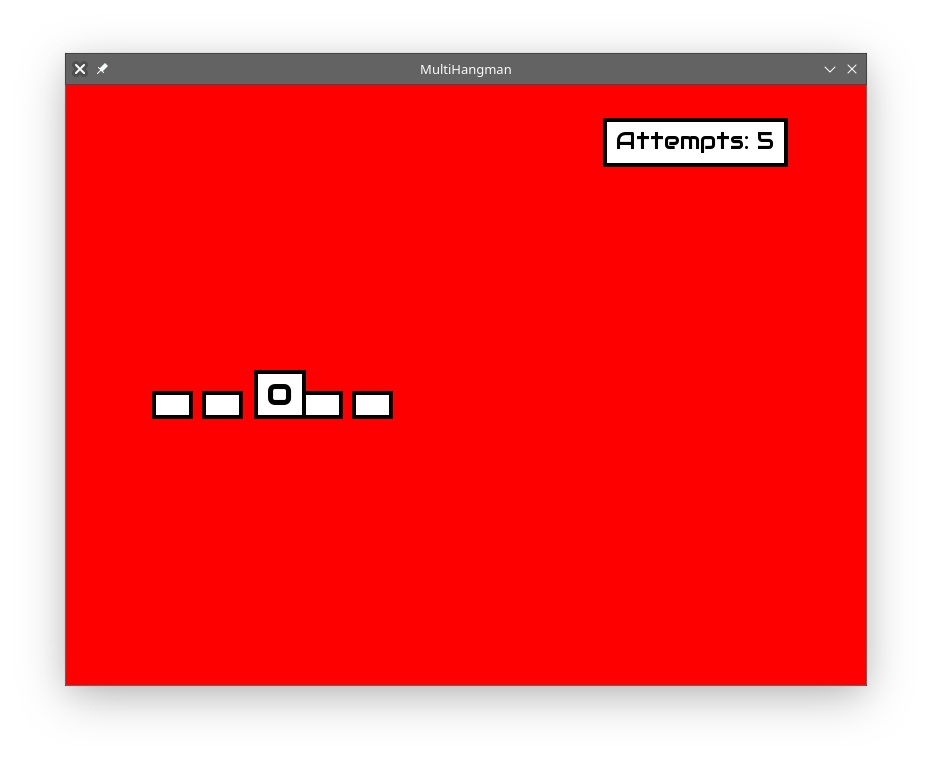

# MultiHangman



(**Yes, the UI will be improved.**)

Multiplayer hangman, Written in Rust™.

This program has two parts: the client and the server. The server uses UDP, and runs on port 22565 (hmm), but you can change this by editing the code. 
Connecting to custom servers coming soon. 

Here's how to set it up.

## Server

You don't need any special external libraries to build the server. Simply `cargo build` or `cargo run`.

### Changing the Server Bind Address

Edit `udpserver/src/lib.rs`. See the code snippet and comment below. 

``` rust
17        let socket = UdpSocket::bind("0.0.0.0:22565")?; // ← Edit the "0.0.0.0:22566" on this line.
18        let mut games = Mutex::new(vec![]);
19        let mut users = Mutex::new(vec![]);
```


## Client

You'll need SFML to build this. Follow the instructions at the [rust-sfml wiki](https://github.com/jeremyletang/rust-sfml/wiki) to get SFML working on your build environment.
You should just be able to run `cargo run` afterwards.

**Note:** Make sure that the server is running before the client, since the client cannot handle a server connection failure gracefully yet.

### Changing the Server Address in the Client

You have to modify `udpclient/src/main.rs`. See the code snippet and comment below:

``` rust
26 let font = Font::from_file(font_path).unwrap();
27 let mut client = HangmanClient::new("127.0.0.1:22565").unwrap(); // ← Change the "127.0.0.1:22565" on this line.
```


Current state: **extremely experimental and everything is unimplemented**

Note: The font used by this project might not be licensed correctly. This will be fixed.
